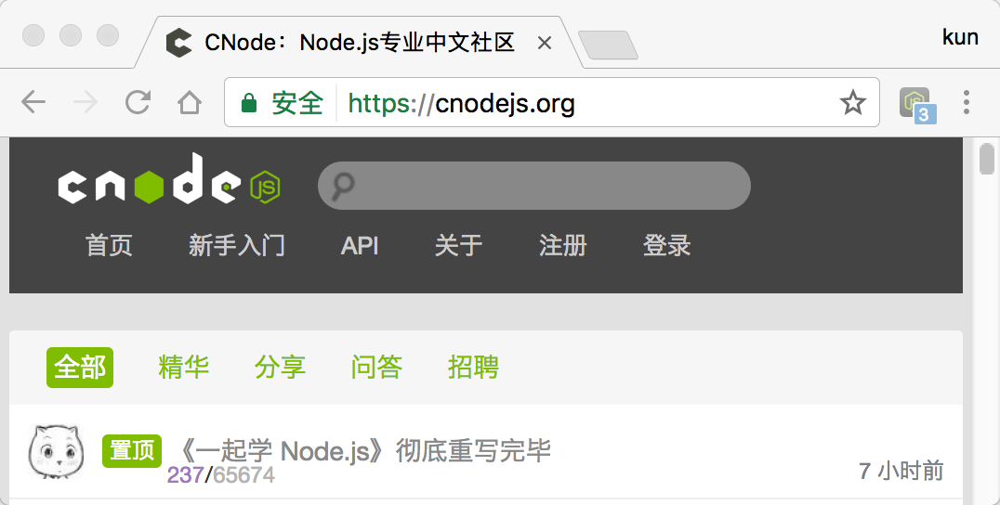

## Chrome CNode Notifier

[CNode](https://cnodejs.org) notifier extension for Chrome.

### Screenshot

### How To Use

1. git clone `https://github.com/nswbmw/chrome-cnode-notifier`
2. open `chrome://extensions/`，click `加载已解压的扩展程序...`
2. enjoy!

### License

MIT